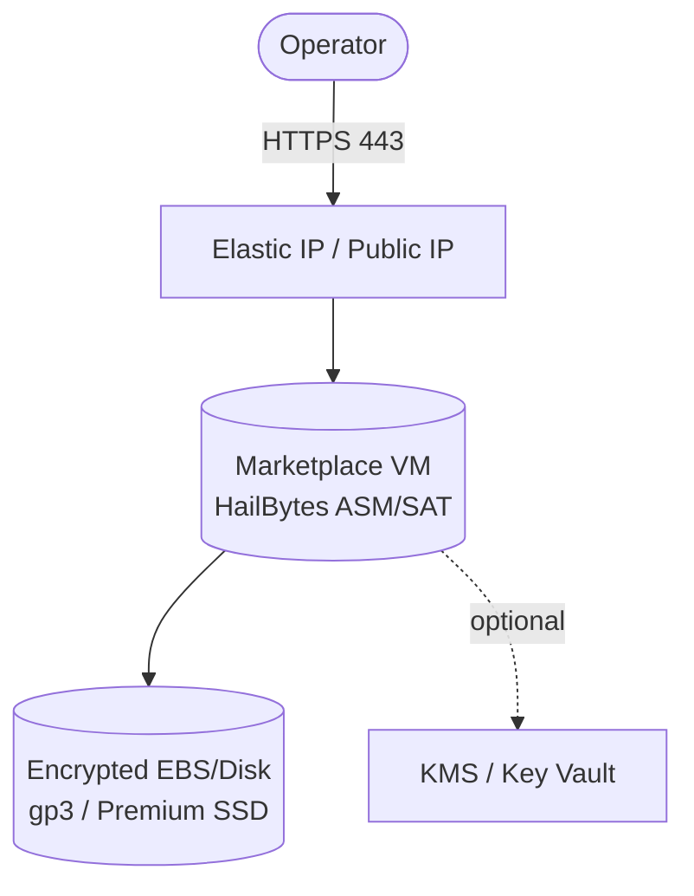
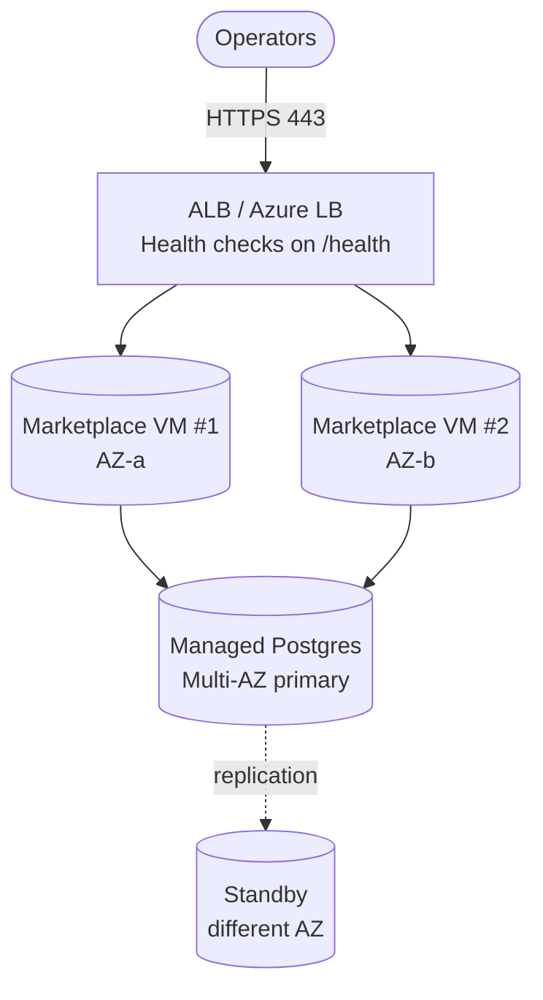
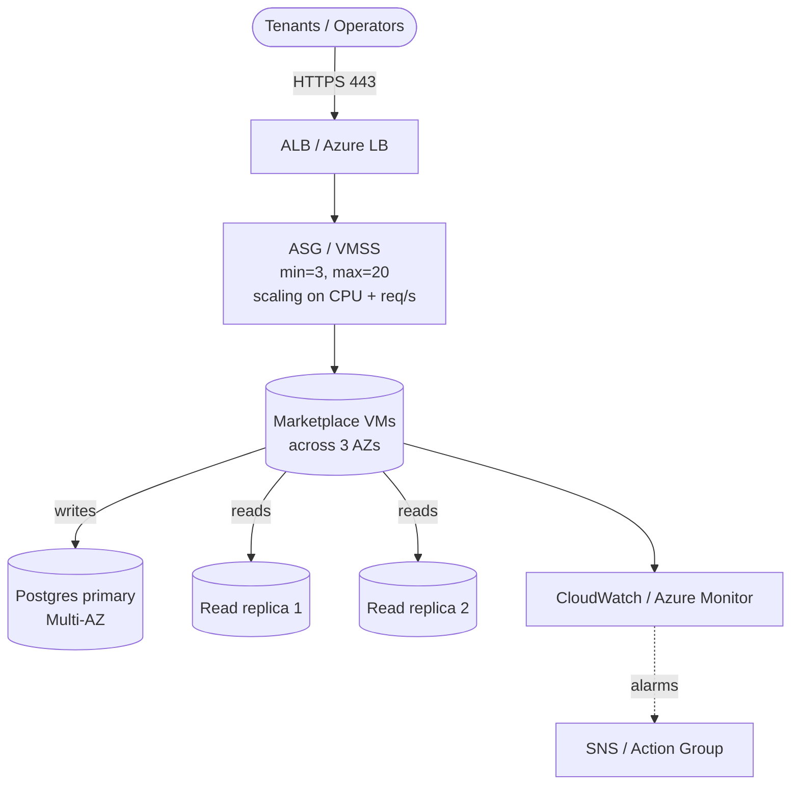

# Architecture

This document covers the architecture of each deployment tier, the shared responsibility model, and the design rationale.

## Design principles

1. **Marketplace-first compute.** Every workload VM is launched from an official HailBytes Marketplace image. The Terraform never builds, copies, or downloads HailBytes software.
2. **Managed services for state.** Persistent data lives in managed Postgres (RDS / Azure Database for PostgreSQL), not on the VM. This makes VMs disposable.
3. **Cloud-native primitives only.** No third-party load balancers, ingresses, or service meshes. ALB / Azure LB. CloudWatch / Azure Monitor.
4. **Security defaults, not knobs.** Encryption at rest, encryption in transit, IMDSv2, restrictive SGs/NSGs, KMS/Key Vault are *on* by default, not opt-in.

---

## Tier 1: `single-vm`

One marketplace VM with an attached encrypted data volume. Suited for dev, PoC, SMB, single-operator workloads.

**State:** local to the VM (SQLite or local Postgres inside the marketplace image).
**Failure mode:** VM loss = data loss unless customer enables snapshots (encouraged via `enable_snapshots = true`).
**Trade-off:** cheapest, fastest to stand up. Not for production with durability SLAs.

---

## Tier 2: `ha-hot-hot`

Two marketplace VMs in active/active behind a Layer-7 load balancer, with shared state in managed Postgres Multi-AZ.

**State:** managed Postgres Multi-AZ. VMs are stateless replicas of the marketplace image.
**Failure mode:** AZ outage — LB drops unhealthy node, surviving VM serves all traffic, DB fails over automatically.
**Trade-off:** ~6× cost of single-vm; production-grade availability without operator intervention.

---

## Tier 3: `unlimited-scale`

Auto Scaling Group / VM Scale Set of marketplace VMs, managed Postgres with read replicas, full observability.

**State:** Postgres primary Multi-AZ + 2× read replicas. Read traffic routed via separate connection string.
**Failure mode:** AZ outage — ASG launches replacements in healthy AZs, DB primary fails over, read replica promoted if needed.
**Use case:** MSSP multi-tenant deployments, large-enterprise single-tenant deployments, workloads with bursty scans / training campaigns.
**Trade-off:** highest cost, highest operational complexity. Earns its keep above ~50 concurrent operators or ~10k scanned assets.

---

## Shared responsibility model

| Layer | Customer | HailBytes | Cloud provider |
|---|---|---|---|
| Physical infrastructure | | | ✔ |
| Hypervisor, host OS | | | ✔ |
| Marketplace VM image (HailBytes software, in-image OS hardening) | | ✔ | |
| Marketplace VM image patching cadence | | ✔ (releases new image versions) | |
| Terraform module code | | ✔ (open source, this repo) | |
| Applying patches to running VMs (replace instance) | ✔ | | |
| Network design (VPCs, subnets, peering) | ✔ | | |
| IAM users, roles, MFA | ✔ | | |
| Backup retention beyond defaults | ✔ | | |
| Application config inside the VM (tenants, users, scan targets) | ✔ | | |
| Marketplace subscription / billing | ✔ | | ✔ (collects) |

---

## What this repo deliberately does NOT do

- **No Dockerfiles or container manifests.** Containers route around marketplace billing.
- **No `user_data` that downloads HailBytes binaries.** Same reason.
- **No custom AMI builds via Packer.** Marketplace AMI is the only source of truth.
- **No bootstrapping the application schema.** The marketplace image is responsible for first-boot setup; modules just connect it to the managed DB via injected env vars.
- **No GovCloud / Azure Government** in v1.
