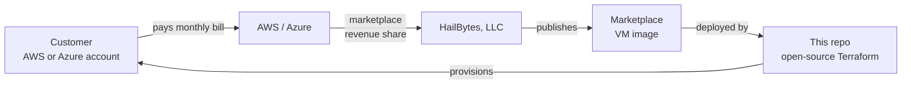

# Billing Model

## TL;DR

> Customer pays AWS or Azure for VM hours via marketplace metering. HailBytes receives revenue through that channel. These Terraform modules are free, open-source infrastructure-as-code that orchestrate paid VMs.

## How money flows

One bill. One channel. One license entitlement check (handled by the marketplace).

## Why this matters

- **License compliance is automatic.** The customer cannot run HailBytes software without an active marketplace subscription — AMI/image launch fails. We do not have to chase audits.
- **No separate license server.** No phone-home, no key files, no procurement friction beyond "click subscribe."
- **Procurement happens through the cloud bill.** Enterprise customers can use existing AWS EDP / Azure MACC commitments. Channel partners pay HailBytes via the marketplace.
- **Free IaC accelerates land/expand.** Customers can stand up a PoC in 15 minutes from a `terraform apply`. The friction is paying the cloud bill, which they were going to pay anyway.

## Why no containers

A Docker image is a self-contained artifact. Once pulled, it runs anywhere with no further enforcement. There is no mechanism for a registry to meter usage downstream, no way to ensure the runner has a paid subscription, and no path for HailBytes to collect revenue from a customer who built their own image from our published one.

The AWS/Azure marketplace solves all of this: the cloud provider attests that the VM is running our image, meters its hours, and remits revenue. We do not have to reinvent metering, license enforcement, or revenue collection — the cloud does it.

If we shipped a Dockerfile, we would be giving away the product. So we don't.

## What is and is not free

| Artifact | License | Cost |
|---|---|---|
| This Terraform repository | MPL-2.0 | Free |
| Module documentation | MPL-2.0 | Free |
| HailBytes ASM Marketplace AMI / Azure image | Commercial EULA accepted at subscribe time | **Paid** (hourly metering) |
| HailBytes SAT Marketplace AMI / Azure image | Commercial EULA accepted at subscribe time | **Paid** (hourly metering) |
| Underlying cloud resources (EC2, RDS, ALB, VPC, EBS, KMS, etc.) | Per AWS/Azure standard pricing | Paid (to cloud provider) |

## Contributor expectations

If you submit a PR, please don't:

- Add a Dockerfile, Helm chart, container build, or `docker-compose.yml` that runs HailBytes software
- Add a `user_data` / cloud-init that downloads HailBytes binaries from any non-marketplace source (S3, a HailBytes-hosted CDN, GitHub Releases, etc.)
- Add modules that deploy from a customer-built AMI/VHD rather than the marketplace listing
- Add escape hatches ("set `use_custom_ami = true` to bypass") that let users skip the marketplace lookup

Any of these will be closed without merge. They are not bugs, they are intentional constraints.
