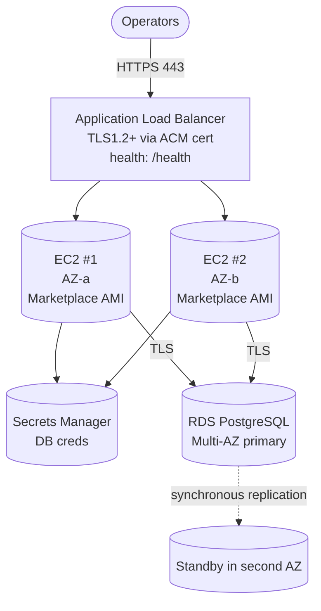

# `ha-hot-hot/aws`

Two HailBytes Marketplace EC2 instances in **active/active** behind an Application Load Balancer, with shared state in **RDS PostgreSQL Multi-AZ**.

> [!IMPORTANT]
> **Marketplace subscription required.** Subscribe to [HailBytes ASM](https://aws.amazon.com/marketplace/pp/prodview-66d5bswmbtfhs) or [HailBytes SAT](https://aws.amazon.com/marketplace/pp/prodview-yyk6iton3ghu4) on AWS Marketplace before applying.

## Architecture



## Cost estimate (us-east-1, on-demand)

| Component | Default | ~Monthly |
|---|---|---|
| 2× EC2 `t3.large` | 24/7 | $120 |
| 2× EBS gp3 root | 50 GB | $8 |
| 2× EBS gp3 data | 200 GB | $32 |
| Application Load Balancer | + LCU | $25 |
| RDS `db.t3.medium` Multi-AZ | 100 GB gp3 | $180 |
| RDS backups | retained | $10 |
| Secrets Manager | 1 secret | $0.40 |
| KMS (if enabled) | 1 | $1 + usage |
| **Total infrastructure** | | **~$375/month** |
| **HailBytes marketplace software fee** | per listing, billed per VM-hour | **separate, x2 hours** |

## Prerequisites

- VPC with at least 2 public subnets (for ALB) and 2 private subnets in different AZs
- ACM certificate in the same region (for the HTTPS listener)
- Marketplace subscription active
- IAM permissions to create EC2, ALB, RDS, IAM, KMS, Secrets Manager

## Usage

```hcl
module "hailbytes_asm_ha" {
  source = "github.com/hailbytes/hailbytes-terraform-modules//modules/ha-hot-hot/aws?ref=v1.0.0"

  product             = "asm"
  environment         = "prod"
  vpc_id              = "vpc-xxxxxxxx"
  public_subnet_ids   = ["subnet-pub-a", "subnet-pub-b"]
  private_subnet_ids  = ["subnet-priv-a", "subnet-priv-b"]
  allowed_cidrs       = ["10.0.0.0/8"]
  acm_certificate_arn = "arn:aws:acm:us-east-1:123456789012:certificate/..."
}
```

## Deployment

```bash
cd examples/basic
cp terraform.tfvars.example terraform.tfvars
terraform init && terraform apply
```

## Post-deploy verification

```bash
# 1. Both targets healthy
aws elbv2 describe-target-health --target-group-arn $(terraform output -raw alb_arn | sed 's/loadbalancer/targetgroup/')

# 2. Health check via ALB DNS
curl https://$(terraform output -raw alb_dns_name)/health

# 3. Simulate failover
aws ec2 stop-instances --instance-ids $(terraform output -json instance_ids | jq -r '.[0]')
# Within ~30s, second instance should serve all traffic at 100% success
```

## Inputs / Outputs

See [`variables.tf`](variables.tf) and [`outputs.tf`](outputs.tf).
