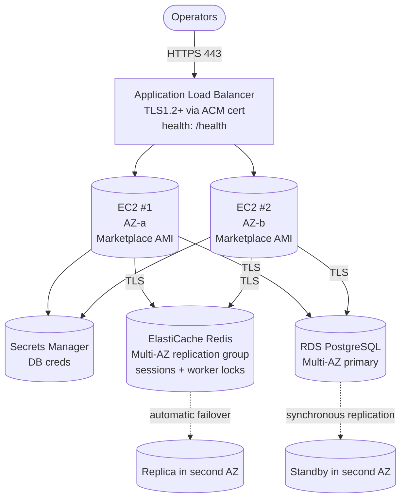

# `ha-hot-hot/aws`

Two HailBytes Marketplace EC2 instances in **active/active** behind an Application Load Balancer, with shared state in **RDS PostgreSQL Multi-AZ**.

> [!IMPORTANT]
> **Marketplace subscription required.** Subscribe to [HailBytes ASM](https://aws.amazon.com/marketplace/pp/prodview-66d5bswmbtfhs) or [HailBytes SAT](https://aws.amazon.com/marketplace/pp/prodview-yyk6iton3ghu4) on AWS Marketplace before applying.

## Architecture



## Cost estimate (us-east-1, on-demand)

Two reference shapes. The defaults below are the **starter** shape; the
**procurement-grade** shape (right column) matches `hailbytes-sat/docs/AWS_HA_DEPLOYMENT.md`
and the customer-facing pricing the account team quotes. Pick the shape
that matches your sizing before sharing numbers with finance.

For the three-shape (single / HA / unlimited-scale) comparison and the
canonical procurement-grade source, see
[`COST_SHAPES.md`](../../../COST_SHAPES.md).

| Component | Starter default | ~Monthly | Procurement-grade variable / value | ~Monthly |
|---|---|---|---|---|
| 2× EC2 SAT/ASM | `instance_type = "t3.large"` | $120 | `instance_type = "m6i.large"` | $140 |
| 2× EBS gp3 root | 50 GB | $8 | 50 GB | $8 |
| 2× EBS gp3 data | `data_volume_size_gb = 200` | $32 | `data_volume_size_gb = 200` | $32 |
| Application Load Balancer | + LCU | $25 | + LCU | $25 |
| ElastiCache Redis Multi-AZ | `redis_node_type = "cache.t4g.small"` | $50 | `redis_node_type = "cache.t4g.small"` | $50 |
| RDS Multi-AZ (`db_mode = "rds"`) | `db_instance_class = "db.t3.medium"` (100 GB gp3) | $180 | `db_instance_class = "db.m6g.large"` (100 GB gp3) | $230 |
| RDS backups | retained | $10 | retained | $10 |
| Cross-AZ data transfer | minimal | $10 | minimal | $20 |
| Secrets Manager | 1 secret | $0.40 | 1 secret | $0.40 |
| KMS (if enabled) | 1 | $1 + usage | 1 | $1 + usage |
| **Total infrastructure** | | **~$435/month** | | **~$515/month** |
| **HailBytes marketplace software fee** ($0.24/vCPU-hr) | 4 vCPU × 730h | **~$700** | 4 vCPU × 730h | **~$700** |
| **All-in (infra + meter)** | | **~$1,135/month** | | **~$1,215/month** |

Single-instance reference (for the procurement delta the account team
quotes): ~$420/month all-in (1× `m6i.large`,
co-located Postgres, no ALB, no Redis, no managed DB). HA lands at
roughly **2.2–2.6× a single-instance bill**.

For the **`db_mode = "ec2"`** path (self-managed Postgres on a third
EC2), drop the RDS line and add ~$70/month for the third `m6i.large`
plus another 200 GB of gp3 (~$16/month). All-in lands at roughly
**~$940/month (≈ 2.2× single)** at procurement-grade sizing.

## Prerequisites

- VPC with at least 2 public subnets (for ALB) and 2 private subnets in different AZs
- ACM certificate in the same region (for the HTTPS listener)
- Marketplace subscription active
- IAM permissions to create EC2, ALB, RDS, ElastiCache, IAM, KMS, Secrets Manager

## Usage

```hcl
module "hailbytes_asm_ha" {
  source = "github.com/hailbytes/hailbytes-terraform-modules//modules/ha-hot-hot/aws?ref=v1.0.0"

  product             = "asm"
  environment         = "prod"
  vpc_id              = "vpc-xxxxxxxx"
  public_subnet_ids   = ["subnet-pub-a", "subnet-pub-b"]
  private_subnet_ids  = ["subnet-priv-a", "subnet-priv-b"]
  allowed_cidrs       = ["10.0.0.0/8"]
  acm_certificate_arn = "arn:aws:acm:us-east-1:123456789012:certificate/..."
}
```

## Deployment

```bash
cd examples/basic
cp terraform.tfvars.example terraform.tfvars
# edit terraform.tfvars — replace every REPLACE placeholder before applying
terraform init && terraform apply
```

For the `HB-PRO-HA` catalog SKU (2 × 8 metered vCores), use
[`examples/hb-pro-ha`](examples/hb-pro-ha) instead — same inputs, with
the SKU's sizing overrides pre-applied. The full SKU → configuration
mapping lives in [`COST_SHAPES.md`](../../../COST_SHAPES.md#simplified-skus--module-configuration).

## Post-deploy verification

```bash
# 1. Both targets healthy
aws elbv2 describe-target-health --target-group-arn $(terraform output -raw alb_arn | sed 's/loadbalancer/targetgroup/')

# 2. Health check via ALB DNS
curl https://$(terraform output -raw alb_dns_name)/health

# 3. Simulate failover
aws ec2 stop-instances --instance-ids $(terraform output -json instance_ids | jq -r '.[0]')
# Within ~30s, second instance should serve all traffic at 100% success
```

## Inputs / Outputs

See [`variables.tf`](variables.tf) and [`outputs.tf`](outputs.tf).
