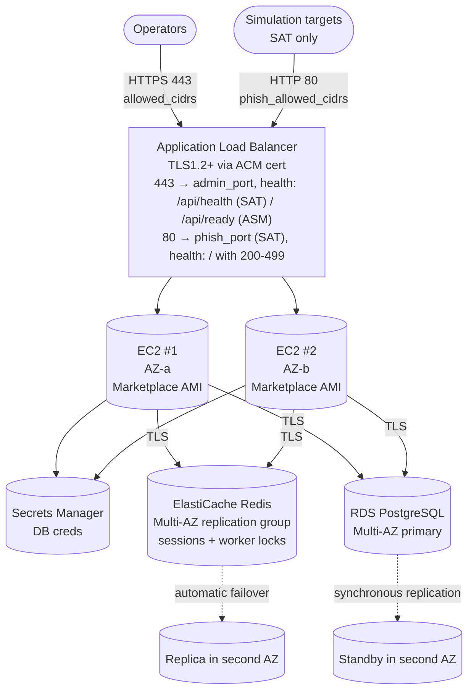

# `ha-hot-hot/aws`

Two HailBytes Marketplace EC2 instances in **active/active** behind an Application Load Balancer, with shared state in **RDS PostgreSQL Multi-AZ**.

> [!IMPORTANT]
> **Marketplace subscription required.** Subscribe to [HailBytes ASM](https://aws.amazon.com/marketplace/pp/prodview-66d5bswmbtfhs) or [HailBytes SAT](https://aws.amazon.com/marketplace/pp/prodview-yyk6iton3ghu4) on AWS Marketplace before applying.

## Architecture


```mermaid
flowchart TB
    User([Operators]) -->|"HTTPS 443<br/>allowed_cidrs"| ALB["Application Load Balancer<br/>TLS1.2+ via ACM cert<br/>443 → admin_port, health: /api/health (SAT) / /api/ready (ASM)<br/>80 → phish_port (SAT), health: / with 200-499"]
    Target([Simulation targets<br/>SAT only]) -->|"HTTP 80<br/>phish_allowed_cidrs"| ALB
    ALB --> VM1[(EC2 #1<br/>AZ-a<br/>Marketplace AMI)]
    ALB --> VM2[(EC2 #2<br/>AZ-b<br/>Marketplace AMI)]
    VM1 --> SM[(Secrets Manager<br/>DB creds)]
    VM2 --> SM
    VM1 -->|TLS| RDS[(ElastiCache Redis<br/>Multi-AZ replication group<br/>sessions + worker locks)]
    VM2 -->|TLS| RDS
    VM1 -->|TLS| DB[(RDS PostgreSQL<br/>Multi-AZ primary)]
    VM2 -->|TLS| DB
    DB -.synchronous replication.-> DBS[(Standby in second AZ)]
    RDS -.automatic failover.-> RDSS[(Replica in second AZ)]
```

## Network exposure: two surfaces, two allow-lists

SAT deployments front **two** things, and they have opposite audiences:

| Surface | Frontend port | Backend | Governed by | Who reaches it |
|---|---|---|---|---|
| Admin console | 443 (HTTPS) | `admin_port` (SAT 3333 / ASM 443) | `allowed_cidrs` | Your operators — an office or VPN range |
| Phishing / landing pages | 80 (HTTP) | `phish_port` (80) | `phish_allowed_cidrs` | Your simulation targets — wherever they are |

`phish_allowed_cidrs` defaults to `null`, which inherits `allowed_cidrs` and
keeps an existing deployment planning clean.

**Inheriting is the wrong answer for most real simulations.** A console locked
to `203.0.113.0/24` also locks every target outside that range out of the
landing pages. The campaign still sends; the targets get a connection timeout;
and the deployment records no opens and no clicks — which looks like a broken
product rather than a firewall rule. Set the list explicitly:

```hcl
allowed_cidrs       = ["203.0.113.0/24"]  # operators only
phish_allowed_cidrs = ["0.0.0.0/0"]       # targets, i.e. the internet
```

`enable_http_redirect` (default `true`) is **ASM-only and inert on SAT**. On SAT
`:80` is the landing surface, and a 301 to HTTPS sent to a target who clicked a
phishing link breaks the simulation. Operators reach the console on 443
directly.

The phishing target group health-checks `/` with a permissive `200-499` matcher
rather than a path with `matcher = "200"`. Landing pages are campaign-specific,
and a fresh phish server answers **404** on `/` (no campaign RID), **302** for a
configured redirect, and **200** on a live campaign URL — all three mean it is
up and routing. Only 5xx drains a target. It also carries no `stickiness`: a
landing-page request carries its own recipient ID and is stateless, so pinning a
target buys nothing and skews load across the pair.

ASM has no phishing surface, so none of these resources are created for it and
`phish_allowed_cidrs` is inert on `asm-aws-ha`.

## Cost estimate (us-east-1, on-demand)

Two reference shapes. The defaults below are the **starter** shape; the
**procurement-grade** shape (right column) matches `hailbytes-sat/docs/AWS_HA_DEPLOYMENT.md`
and the customer-facing pricing the account team quotes. Pick the shape
that matches your sizing before sharing numbers with finance.

For the three-shape (single / HA / unlimited-scale) comparison and the
canonical procurement-grade source, see
[`COST_SHAPES.md`](../../../COST_SHAPES.md).

| Component | Starter default | ~Monthly | Procurement-grade variable / value | ~Monthly |
|---|---|---|---|---|
| 2× EC2 SAT/ASM | `instance_type = "t3.large"` | $120 | `instance_type = "m6i.large"` | $140 |
| 2× EBS gp3 root | 50 GB | $8 | 50 GB | $8 |
| 2× EBS gp3 data | `data_volume_size_gb = 200` | $32 | `data_volume_size_gb = 200` | $32 |
| Application Load Balancer | + LCU | $25 | + LCU | $25 |
| ElastiCache Redis Multi-AZ | `redis_node_type = "cache.t4g.small"` | $50 | `redis_node_type = "cache.t4g.small"` | $50 |
| RDS Multi-AZ (`db_mode = "rds"`) | `db_instance_class = "db.t3.medium"` (100 GB gp3) | $180 | `db_instance_class = "db.m6g.large"` (100 GB gp3) | $230 |
| RDS backups | retained | $10 | retained | $10 |
| Cross-AZ data transfer | minimal | $10 | minimal | $20 |
| Secrets Manager | 1 secret | $0.40 | 1 secret | $0.40 |
| KMS (if enabled) | 1 | $1 + usage | 1 | $1 + usage |
| **Total infrastructure** | | **~$435/month** | | **~$515/month** |
| **HailBytes marketplace software fee** ($0.24/vCPU-hr) | 4 vCPU × 730h | **~$700** | 4 vCPU × 730h | **~$700** |
| **All-in (infra + meter)** | | **~$1,135/month** | | **~$1,215/month** |

Single-instance reference (for the procurement delta the account team
quotes): ~$420/month all-in (1× `m6i.large`,
co-located Postgres, no ALB, no Redis, no managed DB). HA lands at
roughly **2.2–2.6× a single-instance bill**.

For the **`db_mode = "ec2"`** path (self-managed Postgres on a third
EC2), drop the RDS line and add ~$70/month for the third `m6i.large`
plus another 200 GB of gp3 (~$16/month). All-in lands at roughly
**~$940/month (≈ 2.2× single)** at procurement-grade sizing.

> [!NOTE]
> `var.db_deletion_protection` only governs the `db_mode = "rds"` path
> (RDS `deletion_protection` + final snapshot on destroy). For
> `db_mode = "ec2"`, the self-managed Postgres data volume
> (`aws_ebs_volume.db_data`) always has `prevent_destroy = true` —
> unconditionally, regardless of this variable — since a raw EBS volume
> has no snapshot-on-destroy equivalent to fall back on.

## Prerequisites

- VPC with at least 2 public subnets (for ALB) and 2 private subnets in different AZs
- ACM certificate in the same region (for the HTTPS listener)
- Marketplace subscription active
- IAM permissions to create EC2, ALB, RDS, ElastiCache, IAM, KMS, Secrets Manager

## Usage

> No `v1.0.0` tag exists yet ([#48](https://github.com/HailBytes/hailbytes-terraform-modules/issues/48)); pin to a commit SHA instead of `?ref=v1.0.0` until a tagged release ships.

```hcl
module "hailbytes_asm_ha" {
  source = "github.com/hailbytes/hailbytes-terraform-modules//modules/ha-hot-hot/aws?ref=v1.0.0"

  product             = "asm"
  environment         = "prod"
  vpc_id              = "vpc-xxxxxxxx"
  public_subnet_ids   = ["subnet-pub-a", "subnet-pub-b"]
  private_subnet_ids  = ["subnet-priv-a", "subnet-priv-b"]
  allowed_cidrs       = ["10.0.0.0/8"]
  acm_certificate_arn = "arn:aws:acm:us-east-1:123456789012:certificate/..."
}
```

## Deployment

```bash
cd examples/basic
cp terraform.tfvars.example terraform.tfvars
# edit terraform.tfvars — replace every REPLACE placeholder before applying
terraform init && terraform apply
```

For the `HB-PRO-HA` catalog SKU (2 × 8 metered vCores), use
[`examples/hb-pro-ha`](examples/hb-pro-ha) instead — same inputs, with
the SKU's sizing overrides pre-applied. The full SKU → configuration
mapping lives in [`COST_SHAPES.md`](../../../COST_SHAPES.md#simplified-skus--module-configuration).

## Post-deploy verification

```bash
# 1. Both targets healthy
aws elbv2 describe-target-health --target-group-arn $(terraform output -raw alb_arn | sed 's/loadbalancer/targetgroup/')

# 2. Health check via ALB DNS
curl https://$(terraform output -raw alb_dns_name)/health

# 3. Simulate failover
aws ec2 stop-instances --instance-ids $(terraform output -json instance_ids | jq -r '.[0]')
# Within ~30s, second instance should serve all traffic at 100% success
```

## Inputs / Outputs

See [`variables.tf`](variables.tf) and [`outputs.tf`](outputs.tf).
