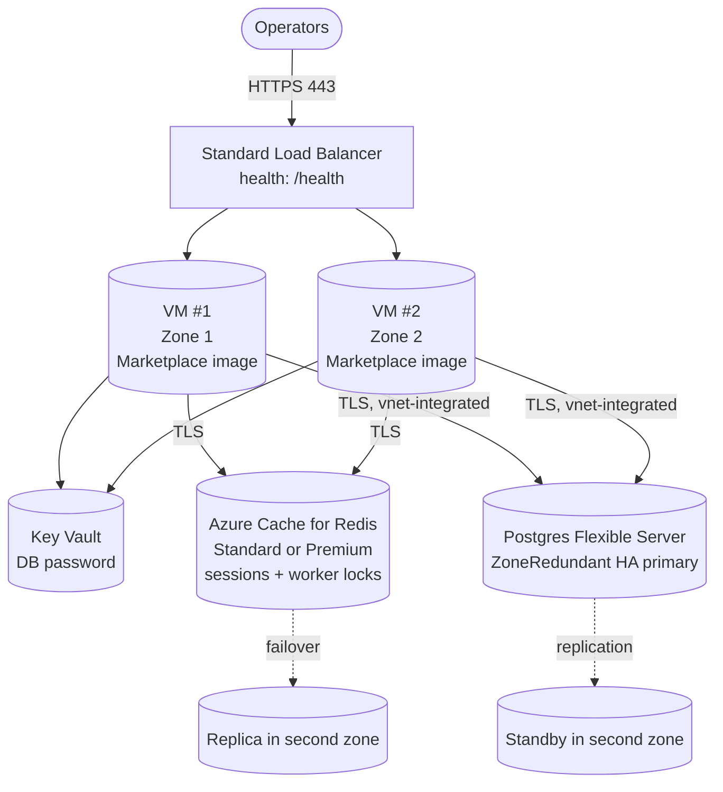

# `ha-hot-hot/azure`

Two HailBytes Marketplace Linux VMs in **active/active** behind a Standard Load Balancer, with shared state in **Azure Database for PostgreSQL Flexible Server** (Zone-Redundant HA).

> [!IMPORTANT]
> **Marketplace subscription required.** Subscribe to [HailBytes ASM](https://marketplace.microsoft.com/en-us/product/virtual-machines/lcmcon1687976613543.hardened_ubuntu_with_rengine) or [HailBytes SAT](https://marketplace.microsoft.com/en-us/product/virtual-machines/lcmcon1687976613543.gophish-phishing-simulator?tab=overview) on Azure Marketplace before applying.

## Architecture



## TLS termination

The default frontend is the Standard Load Balancer, which does **TCP passthrough on 443** — the operator's browser terminates TLS directly against the VM's self-signed certificate. The marketplace AMI generates that certificate on first boot with the per-VM hostname as the CN, so it will **not** match the LB public IP nor any DNS record (Azure Private DNS, Route 53, etc.) you point at it. Browsers will warn on every visit.

For production, pick one:

- **Recommended.** Set `enable_application_gateway = true` and supply a valid PFX bundle via `appgw_tls_pfx_base64` / `appgw_tls_pfx_password`. App Gateway terminates TLS with your certificate; the backend hop to the VMs is not user-visible. This also unlocks `waf_policy_id` for WAF parity with the AWS ALB story.
- Front the module with your own upstream L7 LB / reverse proxy (Azure Front Door, NGINX, etc.) that terminates TLS with a certificate matching the URL operators actually use.

The default LB mode is appropriate for dev / PoC and for compliance-led deployments where the operator URL is the per-VM hostname inside a private vnet.

## Cost estimate (East US, pay-as-you-go)

For the three-shape AWS comparison and the canonical procurement-grade
source, see [`COST_SHAPES.md`](../../../COST_SHAPES.md). Azure pricing
below is the Azure equivalent of the AWS HA table; the marketplace
meter and tier sizing are aligned.

| Component | Default | ~Monthly |
|---|---|---|
| 2× `Standard_D2s_v5` | 24/7 | $140 |
| 2× Premium SSD OS | 64 GB | $20 |
| 2× Premium SSD data | 256 GB | $70 |
| Standard Load Balancer + 1 rule | | $25 |
| Azure Cache for Redis (`Standard C1`, zone-redundant primary/replica) | shared session store | $55 |
| Postgres Flexible Server `GP_Standard_D2ds_v5` Zone-Redundant | 128 GB | $260 |
| Postgres backups | retained 14d | $15 |
| Key Vault | secrets ops | $1 |
| **Total infrastructure** | | **~$585/month** |
| **HailBytes marketplace software fee** ($0.24/vCPU-hr) | 4 vCPU × 730h | **~$700/mo** |
| **All-in (procurement-grade)** | | **~$1,285/month** |

## Prerequisites

- Virtual network with:
  - A subnet for VMs (`vm_subnet_id`)
  - A subnet **delegated** to `Microsoft.DBforPostgreSQL/flexibleServers` (`db_delegated_subnet_id`)
  - A private DNS zone `privatelink.postgres.database.azure.com` linked to the vnet (`private_dns_zone_id`)
- Marketplace subscription accepted (handled by module unless you set `accept_marketplace_terms = false`)
- Subscription-level permissions to provision Azure Cache for Redis (Standard tier or higher — Basic is single-node and not HA-safe)

## Usage

> No `v1.0.0` tag exists yet ([#48](https://github.com/HailBytes/hailbytes-terraform-modules/issues/48)); pin to a commit SHA instead of `?ref=v1.0.0` until a tagged release ships.

```hcl
module "hailbytes_asm_ha" {
  source = "github.com/hailbytes/hailbytes-terraform-modules//modules/ha-hot-hot/azure?ref=v1.0.0"

  product                = "asm"
  environment            = "prod"
  resource_group_name    = "rg-hailbytes-prod"
  location               = "eastus"
  vm_subnet_id           = azurerm_subnet.workload.id
  lb_subnet_id           = azurerm_subnet.workload.id
  db_delegated_subnet_id = azurerm_subnet.db.id
  private_dns_zone_id    = azurerm_private_dns_zone.pg.id
  allowed_cidrs          = ["10.0.0.0/8"]
  admin_username         = "hbadmin"
  ssh_public_key         = file("~/.ssh/id_ed25519.pub")
}
```

## Deployment

```bash
cd examples/basic
cp terraform.tfvars.example terraform.tfvars
# edit terraform.tfvars — replace every REPLACE placeholder before applying
terraform init && terraform apply
```

## Post-deploy verification

```bash
# 1. Public IP serving traffic
curl https://$(terraform output -raw load_balancer_public_ip)/health

# 2. Postgres reachable from VMs (via SSH bastion + psql)
# 3. Failover: stop one VM, verify second continues serving
az vm deallocate -g <rg> -n $(terraform output -json vm_ids | jq -r '.[0] | split("/")[-1]')
```

## Inputs / Outputs

See [`variables.tf`](variables.tf) and [`outputs.tf`](outputs.tf).
