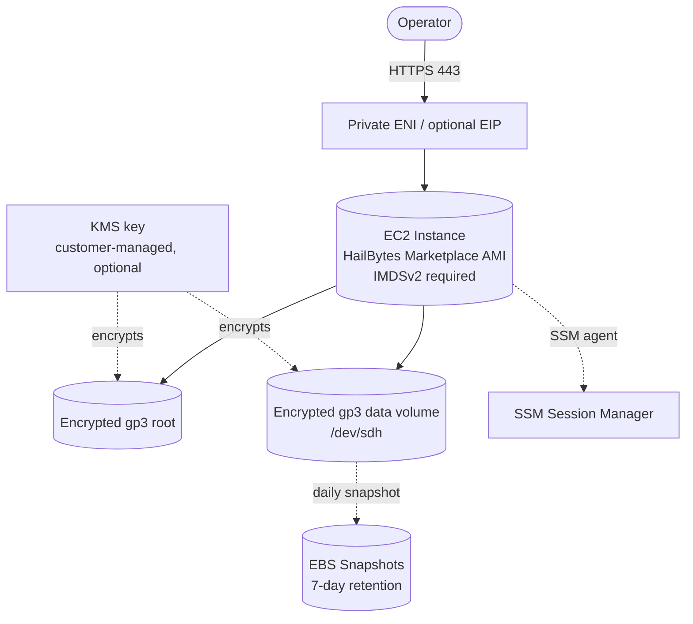

# `single-vm/aws`

Deploys **one HailBytes Marketplace EC2 instance** with an encrypted data volume, IMDSv2 required, SSM Session Manager access, and optional daily snapshots.

> [!IMPORTANT]
> **Marketplace subscription required.** Subscribe to [HailBytes ASM](https://aws.amazon.com/marketplace/search/results?searchTerms=hailbytes-asm) or [HailBytes SAT](https://aws.amazon.com/marketplace/search/results?searchTerms=hailbytes-sat) on AWS Marketplace **before** running `terraform apply`. Without subscription, the AMI lookup fails.

## Architecture



## Cost estimate (us-east-1, on-demand)

| Component | Default | ~Monthly |
|---|---|---|
| EC2 `t3.large` | 1 × 24/7 | $60 |
| EBS gp3 root | 50 GB | $4 |
| EBS gp3 data | 200 GB | $16 |
| EBS snapshots | ~50 GB stored after dedup | $3 |
| KMS key (if enabled) | 1 | $1 + usage |
| **Total infrastructure** | | **~$84/month** |
| **HailBytes marketplace software fee** | per AWS Marketplace listing | **separate** |

## Prerequisites

- AWS account with the chosen HailBytes Marketplace listing subscribed
- VPC + at least one subnet (private subnet recommended)
- Terraform `>= 1.5`, AWS provider `>= 5.0`
- Credentials with permissions to create EC2, EBS, IAM, KMS, DLM resources

## Usage

```hcl
module "hailbytes_asm" {
  source = "github.com/hailbytes/hailbytes-terraform-modules//modules/single-vm/aws?ref=v1.0.0"

  product       = "asm"
  environment   = "prod"
  vpc_id        = "vpc-0a1b2c3d"
  subnet_id     = "subnet-0a1b2c3d"
  allowed_cidrs = ["10.0.0.0/8"]

  # Optional
  instance_type               = "t3.large"
  data_volume_size_gb         = 200
  enable_customer_managed_key = false
  enable_management_access    = true
  enable_snapshots            = true
}
```

See [`examples/basic`](examples/basic) for a runnable configuration.

## Deployment

```bash
cd examples/basic
cp terraform.tfvars.example terraform.tfvars
# edit terraform.tfvars
terraform init
terraform plan
terraform apply
```

## Post-deploy verification

```bash
# 1. Confirm AMI was resolved (means marketplace subscription is active)
terraform output ami_id

# 2. Connect via SSM Session Manager (no SSH key needed)
aws ssm start-session --target $(terraform output -raw instance_id)

# 3. Confirm HailBytes service is up inside the VM
curl -k https://$(terraform output -raw private_ip)/health
```

Expected: HTTP 200 with `{"status":"ok"}` within 3-5 minutes of `terraform apply` completing.

## Inputs

See [`variables.tf`](variables.tf). Required: `product`, `vpc_id`, `subnet_id`, `allowed_cidrs`. All others have defaults.

## Outputs

See [`outputs.tf`](outputs.tf). Notable: `instance_id`, `private_ip`, `data_volume_id`, `console_url`.
