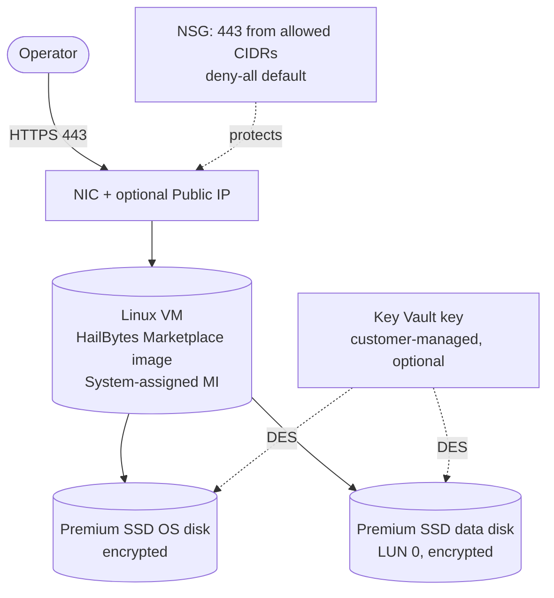

# `single-vm/azure`

Deploys **one HailBytes Marketplace Linux VM** with managed identity, encrypted OS + data disks, and a restrictive NSG.

> [!IMPORTANT]
> **Marketplace subscription required.** Subscribe to [HailBytes ASM](https://marketplace.microsoft.com/en-us/product/virtual-machines/lcmcon1687976613543.hardened_ubuntu_with_rengine) or [HailBytes SAT](https://marketplace.microsoft.com/en-us/product/virtual-machines/lcmcon1687976613543.gophish-phishing-simulator?tab=overview) on Azure Marketplace **before** running `terraform apply`. The module accepts marketplace terms automatically via `azurerm_marketplace_agreement` unless you set `accept_marketplace_terms = false`.

## Architecture



## Cost estimate (East US, pay-as-you-go)

| Component | Default | ~Monthly |
|---|---|---|
| VM `Standard_D2s_v5` | 1 × 24/7 | $70 |
| Premium SSD P6 OS disk | 64 GB | $10 |
| Premium SSD P15 data disk | 256 GB | $35 |
| Public IP (if enabled) | 1 Standard | $4 |
| Key Vault (if CMK enabled) | 1 + operations | ~$3 |
| **Total infrastructure** | | **~$115/month** |
| **HailBytes marketplace software fee** | per Azure Marketplace listing | **separate** |

## Prerequisites

- Azure subscription with the HailBytes Marketplace offer subscribed
- Resource group + virtual network + subnet (existing)
- An Azure Bastion or jump host for management access (recommended over public IPs)
- Terraform `>= 1.5`, azurerm `>= 3.0`

## Usage

```hcl
module "hailbytes_asm" {
  source = "github.com/hailbytes/hailbytes-terraform-modules//modules/single-vm/azure?ref=v1.0.0"

  product             = "asm"
  environment         = "prod"
  resource_group_name = "rg-hailbytes-prod"
  location            = "eastus"
  subnet_id           = azurerm_subnet.workload.id
  allowed_cidrs       = ["10.0.0.0/8"]
  admin_username      = "hbadmin"
  ssh_public_key      = file("~/.ssh/id_ed25519.pub")
}
```

See [`examples/basic`](examples/basic) for a runnable configuration.

## Deployment

```bash
cd examples/basic
cp terraform.tfvars.example terraform.tfvars
# edit terraform.tfvars
terraform init
terraform plan
terraform apply
```

## Post-deploy verification

```bash
# 1. Confirm VM is running
az vm show -g $(terraform output -raw resource_group_name) -n $(terraform output -raw vm_name) --query 'powerState' -o tsv

# 2. Connect via Azure Bastion (preferred) or SSH from a peered network
az network bastion ssh --name <bastion> -g <bastion-rg> --target-resource-id $(terraform output -raw vm_id) --auth-type ssh-key --username hbadmin --ssh-key ~/.ssh/id_ed25519

# 3. Health check
curl -k https://$(terraform output -raw private_ip_address)/health
```

Expected: HTTP 200 `{"status":"ok"}` within 3-5 minutes of `terraform apply`.

## Inputs / Outputs

See [`variables.tf`](variables.tf) and [`outputs.tf`](outputs.tf).
