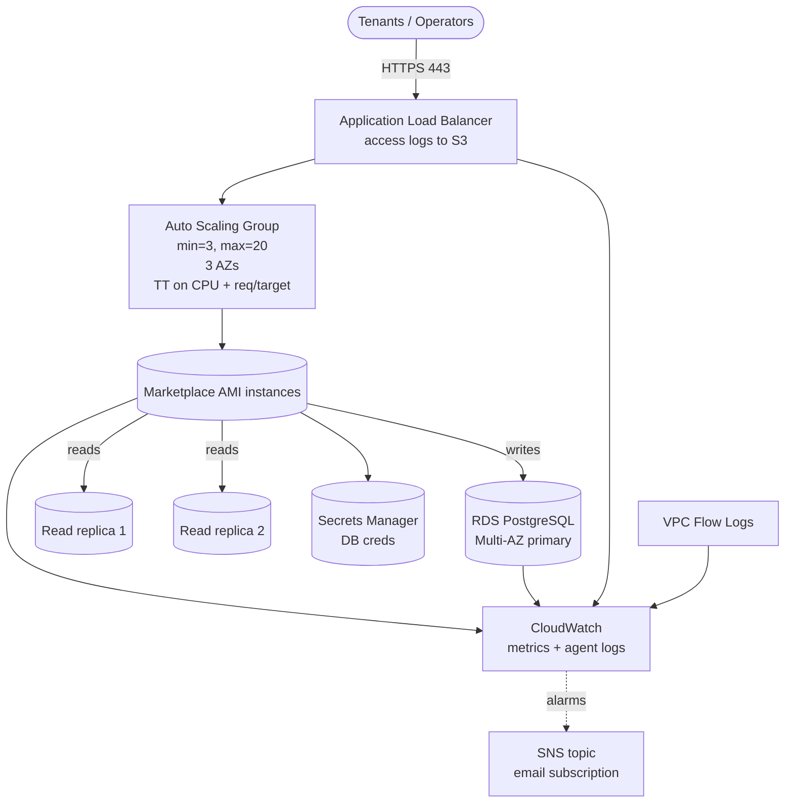

# `unlimited-scale/aws`

Elastic deployment of HailBytes Marketplace VMs: Auto Scaling Group across 3 AZs, ALB, RDS PostgreSQL Multi-AZ + read replicas, CloudWatch alarms wired to SNS, VPC Flow Logs.

> [!IMPORTANT]
> **Marketplace subscription required.** Subscribe to the relevant [HailBytes Marketplace listing](https://aws.amazon.com/marketplace/search/results?searchTerms=hailbytes) before applying. Every instance the ASG launches is billed against your marketplace subscription.

## Architecture



## Cost estimate (us-east-1, on-demand, default sizing)

| Component | Default | ~Monthly |
|---|---|---|
| 3× EC2 `m6i.large` (ASG min) | 24/7 | $225 |
| 3× EBS gp3 root | 50 GB | $12 |
| Application Load Balancer + LCU | | $35 |
| RDS `db.r6g.large` Multi-AZ primary | 200 GB gp3 | $400 |
| 2× RDS read replicas `db.r6g.large` | | $400 |
| RDS backups | 30d retention | $40 |
| S3 access logs | 90d, ~50 GB | $2 |
| CloudWatch logs + alarms | typical | $30 |
| KMS CMK | 1 + usage | $5 |
| Secrets Manager | 1 | $0.40 |
| SNS | low volume | $0.10 |
| **Total infrastructure (3-instance steady state)** | | **~$1,150/month** |
| **+ scale-out hours** | each extra m6i.large 24/7 | +$75/mo per instance |
| **HailBytes marketplace software fee** | per VM-hour, every ASG instance | **separate** |

## Prerequisites

- VPC with at least 2 public subnets (ALB) and 3 private subnets across different AZs
- ACM certificate in the same region
- Marketplace subscription active for the product
- IAM permissions for EC2, ASG, ALB, RDS, IAM, KMS, S3, CloudWatch, SNS, Secrets Manager

## Usage

```hcl
module "hailbytes_asm_scale" {
  source = "github.com/hailbytes/hailbytes-terraform-modules//modules/unlimited-scale/aws?ref=v1.0.0"

  product             = "asm"
  environment         = "prod"
  vpc_id              = "vpc-xxxxxxxx"
  public_subnet_ids   = ["subnet-pub-a", "subnet-pub-b"]
  private_subnet_ids  = ["subnet-priv-a", "subnet-priv-b", "subnet-priv-c"]
  allowed_cidrs       = ["10.0.0.0/8"]
  acm_certificate_arn = "arn:aws:acm:us-east-1:...:certificate/..."
  alert_email         = "soc-oncall@example.com"

  asg_min_size            = 3
  asg_max_size            = 30
  db_read_replica_count   = 2
  db_backup_retention_days = 30
}
```

## Deployment

```bash
cd examples/basic
cp terraform.tfvars.example terraform.tfvars
terraform init && terraform apply
```

## Post-deploy verification

```bash
# 1. ASG launched min instances
aws autoscaling describe-auto-scaling-groups --auto-scaling-group-names $(terraform output -raw autoscaling_group_name) --query 'AutoScalingGroups[0].Instances[*].[InstanceId,LifecycleState,HealthStatus]'

# 2. Targets healthy
TG_ARN=$(aws elbv2 describe-target-groups --names $(terraform output -raw autoscaling_group_name | sed 's/-asg/-tg/') --query 'TargetGroups[0].TargetGroupArn' -o text)
aws elbv2 describe-target-health --target-group-arn $TG_ARN

# 3. End-to-end health
curl https://$(terraform output -raw alb_dns_name)/health

# 4. Confirm read replicas in sync
for r in $(terraform output -json db_read_endpoints | jq -r '.[]'); do
  aws rds describe-db-instances --db-instance-identifier ${r%%.*} --query 'DBInstances[0].StatusInfos'
done
```

## Inputs / Outputs

See [`variables.tf`](variables.tf) and [`outputs.tf`](outputs.tf).
