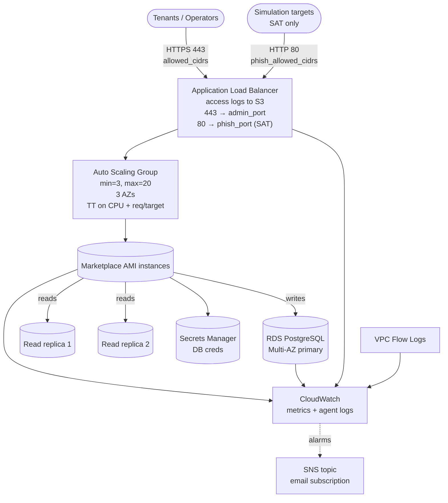

# `unlimited-scale/aws`

Elastic deployment of HailBytes Marketplace VMs: Auto Scaling Group across 3 AZs, ALB, RDS PostgreSQL Multi-AZ + read replicas, CloudWatch alarms wired to SNS, VPC Flow Logs.

> [!IMPORTANT]
> **Marketplace subscription required.** Subscribe to [HailBytes ASM](https://aws.amazon.com/marketplace/pp/prodview-66d5bswmbtfhs) or [HailBytes SAT](https://aws.amazon.com/marketplace/pp/prodview-yyk6iton3ghu4) on AWS Marketplace before applying. Every instance the ASG launches is billed against your marketplace subscription.

## Architecture


```mermaid
flowchart TB
    User([Tenants / Operators]) -->|"HTTPS 443<br/>allowed_cidrs"| ALB["Application Load Balancer<br/>access logs to S3<br/>443 → admin_port<br/>80 → phish_port (SAT)"]
    Target([Simulation targets<br/>SAT only]) -->|"HTTP 80<br/>phish_allowed_cidrs"| ALB
    ALB --> ASG[Auto Scaling Group<br/>min=3, max=20<br/>3 AZs<br/>TT on CPU + req/target]
    ASG --> VMn[(Marketplace AMI instances)]
    VMn -->|writes| DBP[(RDS PostgreSQL<br/>Multi-AZ primary)]
    VMn -->|reads| DBR1[(Read replica 1)]
    VMn -->|reads| DBR2[(Read replica 2)]
    VMn --> SM[(Secrets Manager<br/>DB creds)]
    VMn --> CW[CloudWatch<br/>metrics + agent logs]
    DBP --> CW
    ALB --> CW
    CW -.alarms.-> SNS[SNS topic\nemail subscription]
    VPC[VPC Flow Logs] --> CW
```

## Network exposure: two surfaces, two allow-lists

SAT deployments front **two** things, and they have opposite audiences:

| Surface | Frontend port | Backend | Governed by | Who reaches it |
|---|---|---|---|---|
| Admin console | 443 (HTTPS) | `admin_port` (SAT 3333 / ASM 443) | `allowed_cidrs` | Your operators — an office or VPN range |
| Phishing / landing pages | 80 (HTTP) | `phish_port` (80) | `phish_allowed_cidrs` | Your simulation targets — wherever they are |

`phish_allowed_cidrs` defaults to `null`, which inherits `allowed_cidrs` and
keeps an existing deployment planning clean.

**Inheriting is the wrong answer for most real simulations.** A console locked
to `203.0.113.0/24` also locks every target outside that range out of the
landing pages. The campaign still sends; the targets get a connection timeout;
and the deployment records no opens and no clicks — which looks like a broken
product rather than a firewall rule. Set the list explicitly:

```hcl
allowed_cidrs       = ["203.0.113.0/24"]  # operators only
phish_allowed_cidrs = ["0.0.0.0/0"]       # targets, i.e. the internet
```

`enable_http_redirect` (default `true`) is **ASM-only and inert on SAT**. On SAT
`:80` is the landing surface, and a 301 to HTTPS sent to a target who clicked a
phishing link breaks the simulation. Operators reach the console on 443
directly.

The phishing target group health-checks `/` with a permissive `200-499` matcher
rather than a path with `matcher = "200"`. Landing pages are campaign-specific,
and a fresh phish server answers **404** on `/` (no campaign RID), **302** for a
configured redirect, and **200** on a live campaign URL — all three mean it is
up and routing. Only 5xx drains a target. This matters more here than on the
other tiers: the ASG uses `health_check_type = "ELB"`, so an unhealthy phishing
target gets the whole instance terminated and replaced.

ASM has no phishing surface, so none of these resources are created for it and
`phish_allowed_cidrs` is inert on `asm-aws-autoscale`.

## Cost estimate (us-east-1, on-demand, default sizing)

Unlimited-scale is a fundamentally different cost shape from a single
instance: it adds an ASG, ALB, read replicas, ElastiCache, and the
per-vCore meter scales with N instances rather than the topology itself.
Compare against `modules/single-vm/aws` (~$84/mo infra + meter) and
`modules/ha-hot-hot/aws` (~$435-$515/mo infra + meter) before you quote.

For the three-shape comparison side-by-side and the canonical
procurement-grade source, see [`COST_SHAPES.md`](../../../COST_SHAPES.md).

| Component | Default | ~Monthly |
|---|---|---|
| 3× EC2 `m6i.large` (ASG min) | 24/7 | $225 |
| 3× EBS gp3 root | 50 GB | $12 |
| Application Load Balancer + LCU | | $35 |
| ElastiCache Redis Multi-AZ (`cache.t4g.small`) | shared session store | $50 |
| RDS `db.r6g.large` Multi-AZ primary | 200 GB gp3 | $400 |
| 2× RDS read replicas `db.r6g.large` | | $400 |
| RDS backups | 30d retention | $40 |
| S3 access logs | 90d, ~50 GB | $2 |
| CloudWatch logs + alarms | typical | $30 |
| KMS CMK | 1 + usage | $5 |
| Secrets Manager | 1 | $0.40 |
| SNS | low volume | $0.10 |
| **Total infrastructure (3-instance steady state)** | | **~$1,200/month** |
| **+ scale-out hours** | each extra m6i.large 24/7 | +$75/mo per instance |
| **HailBytes marketplace software fee** ($0.24/vCPU-hr) | 3× 2 vCPU × 730h | **~$1,050/mo** |
| **All-in (3-instance steady state)** | | **~$2,250/month** |

Scale-out adds both an EC2 line and a per-vCPU meter line for every
extra instance. At 5 steady-state instances the bill lands around
$2,950/mo all-in; at 10 instances around $4,700/mo all-in. For
deployments that routinely run above 5 instances, raise `redis_node_type`
to `cache.m6g.large` (~$120/mo) — t4g.small starts becoming a bottleneck
for shared-session throughput in that range.

## Prerequisites

- VPC with at least 2 public subnets (ALB) and 3 private subnets across different AZs
- ACM certificate in the same region
- Marketplace subscription active for the product
- IAM permissions for EC2, ASG, ALB, RDS, ElastiCache, IAM, KMS, S3, CloudWatch, SNS, Secrets Manager

## Usage

> No `v1.0.0` tag exists yet ([#48](https://github.com/HailBytes/hailbytes-terraform-modules/issues/48)); pin to a commit SHA instead of `?ref=v1.0.0` until a tagged release ships.

```hcl
module "hailbytes_asm_scale" {
  source = "github.com/hailbytes/hailbytes-terraform-modules//modules/unlimited-scale/aws?ref=v1.0.0"

  product             = "asm"
  environment         = "prod"
  vpc_id              = "vpc-xxxxxxxx"
  public_subnet_ids   = ["subnet-pub-a", "subnet-pub-b"]
  private_subnet_ids  = ["subnet-priv-a", "subnet-priv-b", "subnet-priv-c"]
  allowed_cidrs       = ["10.0.0.0/8"]
  acm_certificate_arn = "arn:aws:acm:us-east-1:...:certificate/..."
  alert_email         = "soc-oncall@example.com"

  asg_min_size            = 3
  asg_max_size            = 30
  db_read_replica_count   = 2
  db_backup_retention_days = 30
}
```

## Deployment

```bash
cd examples/basic
cp terraform.tfvars.example terraform.tfvars
# edit terraform.tfvars — replace every REPLACE placeholder before applying
terraform init && terraform apply
```

For consortium / national-scale deployments (`HB-SCALE`, 500k+ users,
6 × `m6i.2xlarge` = 48 metered vCores), use
[`examples/hb-scale`](examples/hb-scale) — it pre-applies the sizing this
class is documented to need (`db.r6g.2xlarge`, larger Redis, 500 GB
storage). The full SKU → configuration mapping lives in
[`COST_SHAPES.md`](../../../COST_SHAPES.md#simplified-skus--module-configuration).

## Post-deploy verification

```bash
# 1. ASG launched min instances
aws autoscaling describe-auto-scaling-groups --auto-scaling-group-names $(terraform output -raw autoscaling_group_name) --query 'AutoScalingGroups[0].Instances[*].[InstanceId,LifecycleState,HealthStatus]'

# 2. Targets healthy
TG_ARN=$(aws elbv2 describe-target-groups --names $(terraform output -raw autoscaling_group_name | sed 's/-asg/-tg/') --query 'TargetGroups[0].TargetGroupArn' -o text)
aws elbv2 describe-target-health --target-group-arn $TG_ARN

# 3. End-to-end health
curl https://$(terraform output -raw alb_dns_name)/health

# 4. Confirm read replicas in sync
for r in $(terraform output -json db_read_endpoints | jq -r '.[]'); do
  aws rds describe-db-instances --db-instance-identifier ${r%%.*} --query 'DBInstances[0].StatusInfos'
done
```

## Inputs / Outputs

See [`variables.tf`](variables.tf) and [`outputs.tf`](outputs.tf).
