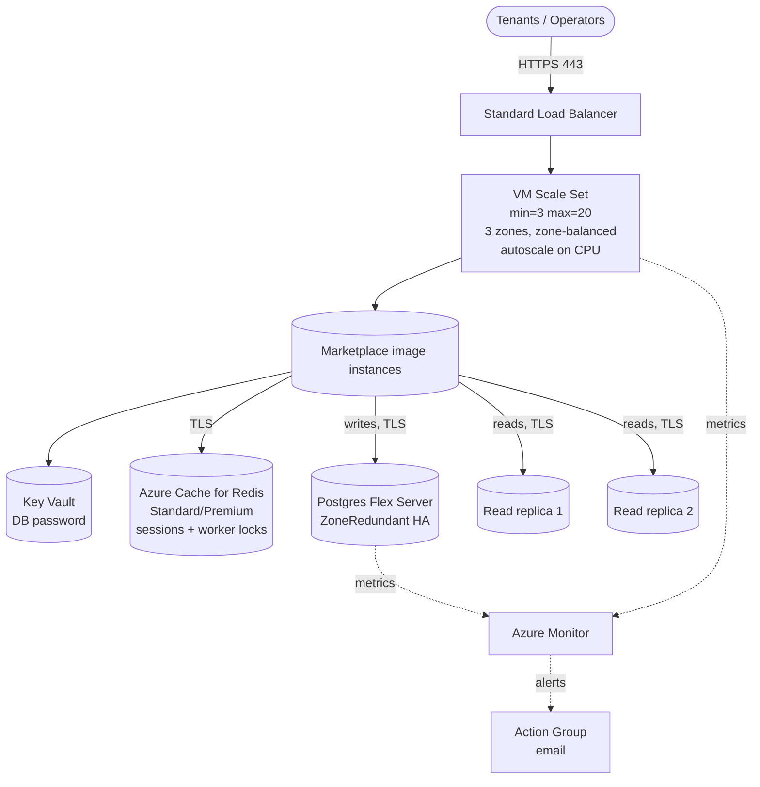

# `unlimited-scale/azure`

Elastic deployment of HailBytes Marketplace VMs on Azure: VM Scale Set across 3 zones, Standard LB, Postgres Flexible Server primary + read replicas, Azure Monitor autoscale & alerts.

> [!IMPORTANT]
> **Marketplace subscription required.** Subscribe to [HailBytes ASM](https://marketplace.microsoft.com/en-us/product/virtual-machines/lcmcon1687976613543.hardened_ubuntu_with_rengine) or [HailBytes SAT](https://marketplace.microsoft.com/en-us/product/virtual-machines/lcmcon1687976613543.gophish-phishing-simulator?tab=overview) on Azure Marketplace before applying. Every instance the VMSS launches is billed against your marketplace subscription.

## Architecture



## TLS termination

The default frontend is the Standard Load Balancer, which does **TCP passthrough on 443** — the operator's browser terminates TLS directly against the VMSS instance's self-signed certificate. Because VMSS instances rotate on autoscale and rolling refresh, the cert CN is the per-instance hostname (generated on first boot from IMDS) and never matches the LB public IP or any DNS record you point at it. Operators see a browser warning on every visit, and the warning surface gets worse as instances roll.

For production, pick one:

- **Recommended.** Set `enable_application_gateway = true` and supply a valid PFX bundle via `appgw_tls_pfx_base64` / `appgw_tls_pfx_password`. App Gateway terminates TLS with your certificate; per-instance certs are no longer user-visible and rolling-refresh stops surfacing cert churn. This also unlocks `waf_policy_id` for WAF parity with the AWS ALB story.
- Front the module with your own upstream L7 LB / reverse proxy (Azure Front Door, NGINX, etc.) that terminates TLS with a certificate matching the URL operators actually use.

The default LB mode is appropriate for dev / PoC and for compliance-led deployments where the operator URL is a per-instance hostname inside a private vnet.

## Cost estimate (East US, pay-as-you-go, default sizing)

Unlimited-scale on Azure is a fundamentally different cost shape from
single-vm or HA hot-hot. Compare against `modules/single-vm/azure` and
`modules/ha-hot-hot/azure` (~$585/mo all-in for HA at procurement-grade)
before quoting. The Azure cost rows are tracked here today; the
canonical AWS table lives in [`COST_SHAPES.md`](../../../COST_SHAPES.md).

| Component | Default | ~Monthly |
|---|---|---|
| 3× VMSS `Standard_D2s_v5` instances | 24/7 | $210 |
| 3× Premium SSD OS disks | 64 GB | $30 |
| Standard Load Balancer + 1 rule | | $25 |
| Azure Cache for Redis (`Standard C1`) | shared session store | $55 |
| Postgres Flex `GP_Standard_D4ds_v5` ZoneRedundant | 256 GB | $600 |
| 2× Postgres Flex read replicas | | $500 |
| Postgres backups | 30d, geo-redundant | $40 |
| Key Vault | secrets ops | $1 |
| Azure Monitor metrics + alerts | typical | $20 |
| **Total infrastructure (3-instance steady state)** | | **~$1,480/month** |
| **+ scale-out hours** | each extra D2s_v5 24/7 | +$70/mo |
| **HailBytes marketplace software fee** ($0.24/vCPU-hr) | 3× 2 vCPU × 730h | **~$1,050/mo** |
| **All-in (3-instance steady state)** | | **~$2,530/month** |

Scale-out behaves the same as the AWS shape: each extra VMSS instance
adds an EC2-line equivalent and a per-vCPU meter line. At 5 steady-
state instances the bill lands around $3,150/mo all-in; at 10 around
$5,150/mo. For deployments above 5 instances raise `redis_capacity`
to 3 (~$220/mo) — `Standard C1` becomes a bottleneck around 5 replicas.

## Prerequisites

- Virtual network with:
  - Workload subnet for the VMSS NICs
  - Subnet delegated to `Microsoft.DBforPostgreSQL/flexibleServers`
  - Private DNS zone `privatelink.postgres.database.azure.com` linked to the vnet
- Marketplace subscription accepted (handled by module)
- Permissions for Compute, Network, DBforPostgreSQL, KeyVault, Monitor, **Cache** (Standard tier or higher — Basic is single-node and breaks horizontal scaling)

## Usage

```hcl
module "hailbytes_asm_scale" {
  source = "github.com/hailbytes/hailbytes-terraform-modules//modules/unlimited-scale/azure?ref=v1.0.0"

  product                = "asm"
  environment            = "prod"
  resource_group_name    = "rg-hailbytes-prod"
  location               = "eastus"
  vm_subnet_id           = azurerm_subnet.workload.id
  db_delegated_subnet_id = azurerm_subnet.db.id
  private_dns_zone_id    = azurerm_private_dns_zone.pg.id
  allowed_cidrs          = ["10.0.0.0/8"]
  admin_username         = "hbadmin"
  ssh_public_key         = file("~/.ssh/id_ed25519.pub")
  alert_email            = "soc-oncall@example.com"

  vmss_min_count   = 3
  vmss_max_count   = 30
  db_replica_count = 2
}
```

## Deployment

```bash
cd examples/basic
cp terraform.tfvars.example terraform.tfvars
# edit terraform.tfvars — replace every REPLACE placeholder before applying
terraform init && terraform apply
```

## Post-deploy verification

```bash
# 1. VMSS instances healthy across zones
az vmss list-instances -g $(terraform output -raw resource_group_name) -n $(terraform output -raw vmss_name) -o table

# 2. End-to-end health
curl https://$(terraform output -raw load_balancer_public_ip)/health

# 3. Replicas in sync
for r in $(terraform output -json postgres_replica_fqdns | jq -r '.[]'); do
  echo "replica: $r"
done
```

## Inputs / Outputs

See [`variables.tf`](variables.tf) and [`outputs.tf`](outputs.tf).
