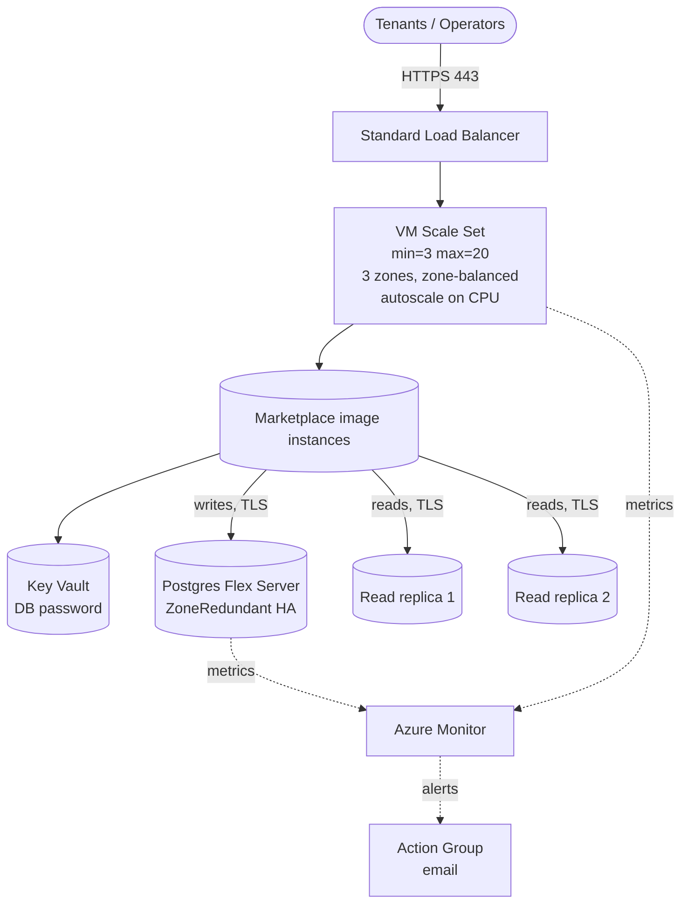

# `unlimited-scale/azure`

Elastic deployment of HailBytes Marketplace VMs on Azure: VM Scale Set across 3 zones, Standard LB, Postgres Flexible Server primary + read replicas, Azure Monitor autoscale & alerts.

> [!IMPORTANT]
> **Marketplace subscription required.** Subscribe to the relevant [HailBytes Azure Marketplace listing](https://azuremarketplace.microsoft.com/marketplace/apps?search=hailbytes) before applying. Every instance the VMSS launches is billed against your marketplace subscription.

## Architecture



## Cost estimate (East US, pay-as-you-go, default sizing)

| Component | Default | ~Monthly |
|---|---|---|
| 3× VMSS `Standard_D2s_v5` instances | 24/7 | $210 |
| 3× Premium SSD OS disks | 64 GB | $30 |
| Standard Load Balancer + 1 rule | | $25 |
| Postgres Flex `GP_Standard_D4ds_v5` ZoneRedundant | 256 GB | $600 |
| 2× Postgres Flex read replicas | | $500 |
| Postgres backups | 30d, geo-redundant | $40 |
| Key Vault | secrets ops | $1 |
| Azure Monitor metrics + alerts | typical | $20 |
| **Total infrastructure (3-instance steady state)** | | **~$1,425/month** |
| **+ scale-out hours** | each extra D2s_v5 24/7 | +$70/mo |
| **HailBytes marketplace software fee** | per VM-hour, every VMSS instance | **separate** |

## Prerequisites

- Virtual network with:
  - Workload subnet for the VMSS NICs
  - Subnet delegated to `Microsoft.DBforPostgreSQL/flexibleServers`
  - Private DNS zone `privatelink.postgres.database.azure.com` linked to the vnet
- Marketplace subscription accepted (handled by module)
- Permissions for Compute, Network, DBforPostgreSQL, KeyVault, Monitor

## Usage

```hcl
module "hailbytes_asm_scale" {
  source = "github.com/hailbytes/hailbytes-terraform-modules//modules/unlimited-scale/azure?ref=v1.0.0"

  product                = "asm"
  environment            = "prod"
  resource_group_name    = "rg-hailbytes-prod"
  location               = "eastus"
  vm_subnet_id           = azurerm_subnet.workload.id
  db_delegated_subnet_id = azurerm_subnet.db.id
  private_dns_zone_id    = azurerm_private_dns_zone.pg.id
  allowed_cidrs          = ["10.0.0.0/8"]
  admin_username         = "hbadmin"
  ssh_public_key         = file("~/.ssh/id_ed25519.pub")
  alert_email            = "soc-oncall@example.com"

  vmss_min_count   = 3
  vmss_max_count   = 30
  db_replica_count = 2
}
```

## Deployment

```bash
cd examples/basic
cp terraform.tfvars.example terraform.tfvars
terraform init && terraform apply
```

## Post-deploy verification

```bash
# 1. VMSS instances healthy across zones
az vmss list-instances -g $(terraform output -raw resource_group_name) -n $(terraform output -raw vmss_name) -o table

# 2. End-to-end health
curl https://$(terraform output -raw load_balancer_public_ip)/health

# 3. Replicas in sync
for r in $(terraform output -json postgres_replica_fqdns | jq -r '.[]'); do
  echo "replica: $r"
done
```

## Inputs / Outputs

See [`variables.tf`](variables.tf) and [`outputs.tf`](outputs.tf).
